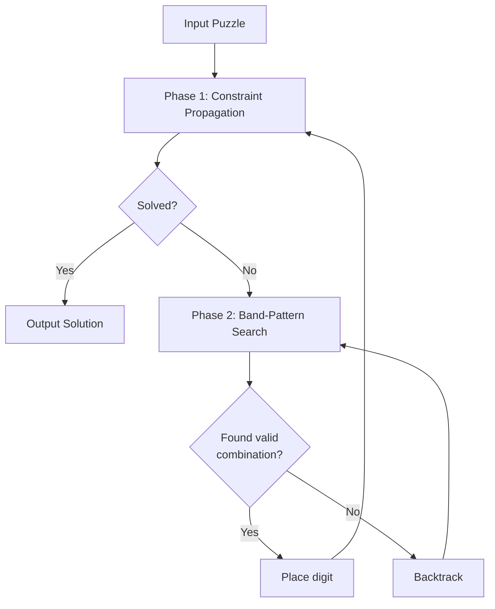
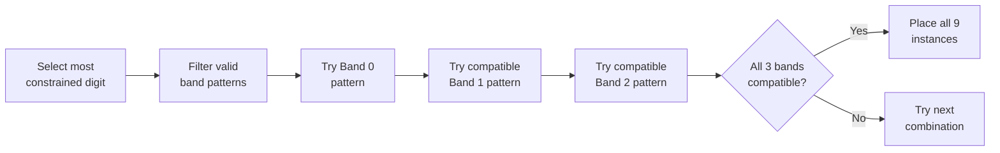

# Sudokumaci - Zig Sudoku Solver

A high-performance Sudoku solver that solves ~750,000 puzzles per second on modern hardware. Instead of the traditional "guess a cell" backtracking, this solver places **entire digits at once** using a novel band-pattern approach.

## The Core Idea: Digit-Centric Solving

Traditional solvers ask: *"What digit goes in this cell?"*

This solver asks: *"Where do all 9 instances of this digit go?"*

```
Traditional (Cell-Centric)          This Solver (Digit-Centric)
┌───┬───┬───┐                       ┌───┬───┬───┐
│ ? │   │   │  "What goes here?"    │ 5 │   │   │  "Where do all the
├───┼───┼───┤                       ├───┼───┼───┤   5s go?"
│   │   │   │                       │   │   │ 5 │
├───┼───┼───┤                       ├───┼───┼───┤
│   │   │   │                       │   │ 5 │   │
└───┴───┴───┘                       └───┴───┴───┘
```

## Understanding Band Patterns

A Sudoku grid has three horizontal **bands** (rows 0-2, 3-5, 6-8). For any single digit, there are exactly **162 valid ways** to place it within one band. We call these "band patterns."

```
Band 0 (rows 0-2)    ┌─────────────────────────────┐
                     │  One of 162 valid patterns  │
                     │  for placing digit "5"      │
─────────────────    └─────────────────────────────┘

Band 1 (rows 3-5)    ┌─────────────────────────────┐
                     │  One of 162 valid patterns  │
                     │  for placing digit "5"      │
─────────────────    └─────────────────────────────┘

Band 2 (rows 6-8)    ┌─────────────────────────────┐
                     │  One of 162 valid patterns  │
                     │  for placing digit "5"      │
                     └─────────────────────────────┘
```

### Why 162 Patterns?

In a 3×9 band, a digit must appear once in each of the 3 rows and once in each of the 3 boxes:

```
     Box 0      Box 1      Box 2
   ┌───┬───┬───┬───┬───┬───┬───┬───┬───┐
R0 │ 5 │ · │ · │ · │ · │ · │ · │ · │ · │  ← 5 is in column 0
   ├───┼───┼───┼───┼───┼───┼───┼───┼───┤
R1 │ · │ · │ · │ · │ 5 │ · │ · │ · │ · │  ← 5 is in column 4
   ├───┼───┼───┼───┼───┼───┼───┼───┼───┤
R2 │ · │ · │ · │ · │ · │ · │ · │ 5 │ · │  ← 5 is in column 7
   └───┴───┴───┴───┴───┴───┴───┴───┴───┘
```

For row 0: 9 column choices. For row 1: must be in different box, 6 choices. For row 2: must be in remaining box, 3 choices. But we also need different columns... combinatorics gives us exactly **162** valid patterns.

## The Two-Phase Algorithm



### Phase 1: Constraint Propagation

The propagation engine eliminates impossible candidates using three techniques:

#### 1. Naked Singles
When a cell has only one possible digit remaining, place it:
```
A cell's candidates get eliminated by placed digits in its row, column, and box:

         Column already has 1,2,3,5,6,7,8
                    ↓
┌───┬───┬───┬───┬───┬───┬───┬───┬───┐
│ 2 │ 5 │ 1 │ 8 │ ? │ 3 │ 6 │ 7 │ 9 │ ← Row already has 1,2,3,5,6,7,8,9
└───┴───┴───┴───┴───┴───┴───┴───┴───┘
                    ↑
         Only digit 4 remains → Place 4!
```

#### 2. Hidden Singles
When a digit can only go in one cell within a row/column/box:
```
Row analysis for digit "3":
┌───┬───┬───┬───┬───┬───┬───┬───┬───┐
│ X │ X │ X │ X │ ✓ │ X │ X │ X │ X │  ← Only one cell can have 3
└───┴───┴───┴───┴───┴───┴───┴───┴───┘
                 ↓
              Place 3 here!
```

#### 3. Box-Line Reduction
When a digit in a box is confined to a single row, eliminate it from that row in other boxes:
```
┌───────────┬───────────┬───────────┐
│ · │ · │ 3?│ 3?│ 3?│ · │ · │ · │ · │  ← 3 can only be in columns 2-4
├───┼───┼───┼───┼───┼───┼───┼───┼───┤     of this row within Box 0
│ · │ · │ · │   │   │   │   │   │   │
├───┼───┼───┼───┼───┼───┼───┼───┼───┤  So eliminate 3 from columns
│ · │ · │ · │   │   │   │   │   │   │  3-8 in row 0!
└───────────┴───────────┴───────────┘
    Box 0       Box 1       Box 2
```

### Phase 2: Band-Pattern Search

When propagation stalls, we search for valid digit placements:



#### Compatibility Filtering

Not all band patterns work together. We precompute two compatibility tables:

**DIGIT_COMPATIBLE_BANDS**: Patterns that don't share any cells
```
Band 0: 5 at columns (0, 4, 7)   ✓ Compatible - no overlapping columns
Band 1: 5 at columns (2, 5, 8)   ✓ for different digits in same band
Band 2: 5 at columns (1, 3, 6)   ✓
```

**BOARD_COMPATIBLE_BANDS**: Patterns that use different column sets
```
Band 0: 5 at (0, 4, 7)           
Band 1: 5 at (1, 5, 6)  ← Must use columns NOT used by other bands
Band 2: 5 at (2, 3, 8)    (for same digit across bands)
```

## Data Structures: Bitboards

The entire puzzle state fits in a few integers using **bitboards**:

```
digit_candidate_cells[9] - One u128 per digit
                           ↓
┌─────────────────────────────────────────────────────────────────────────────────┐
│ bit 0   bit 1   bit 2  ...  bit 80                                              │
│   ↓       ↓       ↓           ↓                                                 │
│ ┌───┬───┬───┬───┬───┬───┬───┬───┬───┐                                           │
│ │ 1 │ 0 │ 1 │ 1 │ 0 │ 1 │ 0 │ 1 │ 1 │ ... (81 bits total)                       │
│ └───┴───┴───┴───┴───┴───┴───┴───┴───┘                                           │
│   ↑                                                                             │
│   Cell 0 can hold this digit                                                    │
└─────────────────────────────────────────────────────────────────────────────────┘
```

**Why bitboards?**
- Eliminate a digit from 20 cells (peers)? One AND operation: `candidates &= ~peer_mask`
- Count candidates? One instruction: `@popCount(candidates)`
- Find first candidate? One instruction: `@ctz(candidates)`

## Compile-Time Precomputation

All lookup tables are generated at compile time using Zig's `comptime`:

| Table | Size | Purpose |
|-------|------|---------|
| `VALID_BAND_CELLS[162]` | 162 patterns | All valid digit placements in a band |
| `ROW_BANDS[3][512]` | 3×512 entries | Row mask → compatible band patterns |
| `ROW_BOARD_CLEARS[9][512]` | 9×512 entries | Row mask → applicable reductions |
| `PATTERNS_FOR_OTHER_DIGITS[162]` | 162 bitmasks | Pattern → non-overlapping patterns |
| `PATTERNS_FOR_SAME_DIGIT[162]` | 162 bitmasks | Pattern → column-compatible patterns |

This means **zero runtime overhead** for pattern enumeration!

## Concurrency: Dynamic Batch Assignment

For batch processing, threads dynamically claim work from a shared pool:

```
                    Shared Atomic Counter
                    ┌─────────────────┐
                    │  next_batch: 4  │
                    └────────┬────────┘
                             │
         ┌───────────────────┼───────────────────┐
         │                   │                   │
         ▼                   ▼                   ▼
    ┌─────────┐         ┌─────────┐         ┌─────────┐
    │Thread 0 │         │Thread 1 │         │Thread 2 │
    │ Batch 0 │         │ Batch 1 │         │ Batch 2 │
    │  done!  │         │working..│         │  done!  │
    └────┬────┘         └─────────┘         └────┬────┘
         │                                       │
         └──► atomic_fetch_add ◄─────────────────┘
                    │
              "I got batch 4!"
              "I got batch 5!"
```

Each thread atomically increments the counter to claim its next batch. Whoever finishes first gets the next available batch—no coordination, no waiting, no contention.

**Note:** This is simpler than true "work-stealing" (where threads take from each other's queues). Here, all unclaimed work lives in one shared pool.

## Performance

On modern hardware, solving ~49,000 17-clue puzzles:

| Metric | Value |
|--------|-------|
| Wall time | ~65ms |
| Puzzles/second | ~750,000 |
| Time per puzzle | ~1.3 microseconds |

## Build & Run

### Requirements
- Zig 0.14.0 or newer

### Build
```bash
zig build-exe -O ReleaseFast -mcpu=native main.zig
```

### Usage
```bash
# Solve puzzles from file (one 81-char puzzle per line, '0' for empty cells)
./main puzzles.txt > solutions.txt

# Benchmark
time ./main ../test-data/all_17_clue.sudokus > /dev/null
```

### Input Format
```
000000010400000000020000000000050407008000300001090000300400200050100000000806000
005300000800000020070010500400005300010070006003200080060500009004000030000009700
...
```

### Output Format
```
000000010400000000020000000000050407008000300001090000300400200050100000000806000,693784512487512936125963874932651487568247391741398625319475268856129743274836159
005300000800000020070010500400005300010070006003200080060500009004000030000009700,145327698839654127672918543496185372218473956753296481367542819984761235521839764
...
```

## Why This Approach?

| Aspect | Traditional Backtracking | Band-Pattern Search |
|--------|-------------------------|---------------------|
| Branching factor | Up to 9 per cell | ~tens per digit |
| Decisions per puzzle | Up to 81 | Up to 9 |
| Constraint checking | Per-cell validation | Pre-filtered by tables |
| Cache efficiency | Random cell access | Sequential table lookups |

By searching at the digit level instead of the cell level, we make fewer decisions with better-informed choices.
